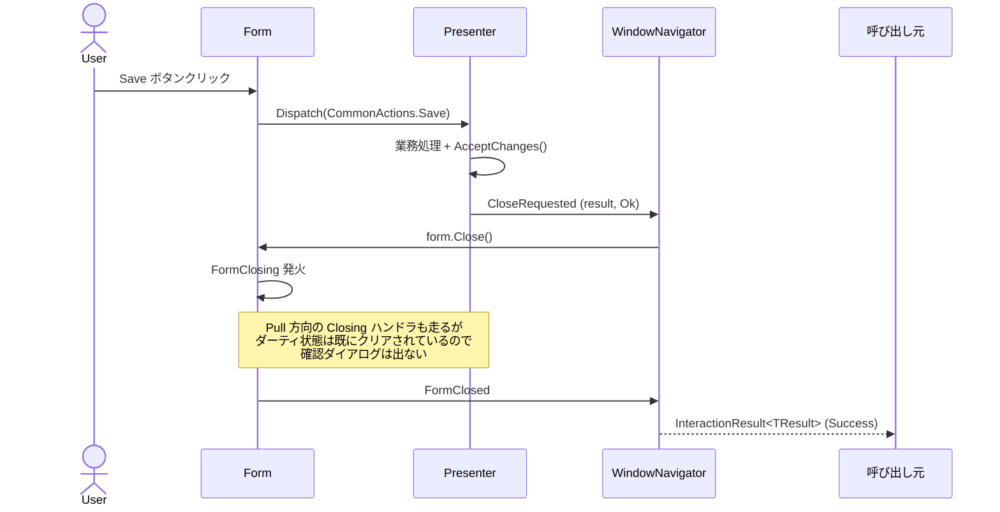
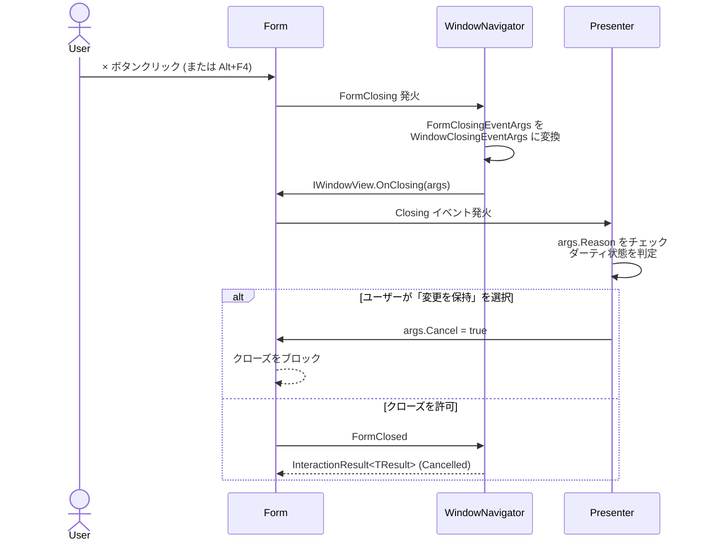

# ウィンドウクローズモデル

このページでは、本フレームワークが採用する **二方向イベント駆動のウィンドウクローズモデル** の設計思想を解説します。
完全な実装例とテストパターンは [HowTo: ウィンドウクローズを扱う](HowTo-Handle-Window-Closing) を、`WindowNavigator` の API リファレンスは [WindowNavigator](Reference-WindowNavigator) を参照してください。

> **この設計を理解することは、ダーティチェック・保存確認・キャンセル動作を正しく実装するうえで必須です。**

---

## なぜ専用モデルが必要か

WinForms の `Form.FormClosing` は、ユーザーが × ボタンを押した場合だけでなく、**システムシャットダウン・タスクマネージャ・親ウィンドウからの伝播・コードからの `Close()` 呼び出し** をすべて同じイベントに集約します。
さらに `FormClosingEventArgs` は WinForms 名前空間の型なので、Presenter が直接扱うと [MVP の 3 つの鉄則](Concept-MVP-Pattern#3-つの鉄則-three-iron-rules) のうち 2 つに違反します (鉄則 1: View インターフェイスから UI 型を排除、鉄則 2: Presenter から UI 型を排除)。

このフレームワークは、これらの問題を **2 つの独立した方向のイベント** に分解することで解決します。

---

## メンタルモデル: Push と Pull

| 方向 | 起点 | イベント | 何を運ぶか | 典型的なトリガー |
|------|------|---------|----------|---------------|
| **Push** | Presenter | `IRequestClose<TResult>.CloseRequested` | `TResult` + `InteractionStatus` | ユーザーが Save / Cancel / OK を押した |
| **Pull** | フレームワーク | `IWindowView.Closing` | `CloseReason` + `Cancel` フラグ | ユーザーが × / Alt+F4 / システムシャットダウン |

両経路は最終的に WinForms の `FormClosed` で合流し、`ShowWindowAsModal` の呼び出し元には **同じ `InteractionResult<TResult>`** が返ります。
WinForms `FormClosing` から本フレームワークの抽象への変換は `WindowNavigator` が一度だけ行うので、**Presenter は WinForms 型を一切見ません**。

### Push 方向: Presenter が能動的に閉じる



### Pull 方向: 外部トリガーで閉じる



---

## 単一情報源 (Single Source of Truth) の不変条件

> **ダーティ状態の確認ダイアログは、Pull 方向のハンドラ (`View.Closing`) にだけ書く。**

Push 方向のハンドラ (`OnSave` / `OnCancel` / `OnDiscard`) は、`RequestClose` を呼ぶ **前に** ダーティフラグを確定させます。
その後にフレームワークから発火する `FormClosing → IWindowView.Closing` は **既にクリーンな状態を観測する** ため、二重に確認ダイアログが出ることはありません。

この設計判断により得られるもの:

- Presenter の公開 API は最小限 (`IRequestClose.CloseRequested` イベントのみ)
- 「ダーティ状態をどう聞くか」のロジックが **1 か所だけに** 集約される
- テストが 2 方向それぞれを独立に検証できる: Pull は `View.Closing` をシミュレート、Push は `CloseRequested` を観測

---

## 最小スケッチ

完全な実装例は [HowTo: ウィンドウクローズを扱う](HowTo-Handle-Window-Closing) を参照してください。
ここでは「Push と Pull の連携部分」だけを最小コードで示します。

```csharp
public class EditUserPresenter : WindowPresenterBase<IEditUserView>,
                                  IRequestClose<UserResult>
{
    public event EventHandler<CloseRequestedEventArgs<UserResult>> CloseRequested;

    protected override void OnViewAttached()
        => View.Closing += OnViewClosing;            // Pull 方向を購読

    // Pull: 外部トリガーでの閉じる試みをハンドリング
    private void OnViewClosing(object sender, WindowClosingEventArgs args)
    {
        if (args.Reason == CloseReason.SystemShutdown) return;

        if (_changeTracker.IsChanged &&
            !Messages.ConfirmYesNo("Discard unsaved changes?", "Confirm"))
        {
            args.Cancel = true;
        }
    }

    // Push: Save ボタンから呼ばれる
    private void OnSave()
    {
        SaveUser(_changeTracker.CurrentValue);
        _changeTracker.AcceptChanges();              // ← RaiseClose の前に確定
        RaiseClose(new UserResult { /* ... */ }, InteractionStatus.Ok);
    }

    private void RaiseClose(UserResult result, InteractionStatus status)
        => CloseRequested?.Invoke(this,
            new CloseRequestedEventArgs<UserResult>(result, status));
}
```

**重要なポイント**: `OnSave` で `AcceptChanges()` を呼んでから `RaiseClose` する。
こうすると、その後に走る Pull 方向の `OnViewClosing` は「ダーティではない」と判定し、再確認ダイアログが出ません。

---

## Form 側のお決まりコード

`IWindowView` を実装する Form には、以下の **2 行のボイラープレート** が必要です。
`Form` には既に非推奨の `Closing` イベントと `protected OnClosing` メソッドが存在するため、名前衝突を避けるべく **明示的インターフェイス実装** にします。

```csharp
private EventHandler<WindowClosingEventArgs> _closing;
event EventHandler<WindowClosingEventArgs> IWindowView.Closing
{
    add => _closing += value;
    remove => _closing -= value;
}
void IWindowView.OnClosing(WindowClosingEventArgs args) => _closing?.Invoke(this, args);
```

Form 自身が `FormClosing` を購読する必要はありません。`WindowNavigator` が `CreateAndBindForm` の際に自動的にブリッジします。

---

## `CloseReason` 列挙

`System.Windows.Forms.CloseReason` ではなく、本フレームワーク独自の列挙を使います。
これにより View インターフェイスから WinForms 名前空間を完全に排除できます。

```csharp
public enum CloseReason
{
    Normal,           // × / Alt+F4 / Presenter 起点の Form.Close → ダーティチェックすべき
    SystemShutdown,   // Windows がシャットダウン中 → ブロックしない
    TaskManager,      // 強制終了 → ブロックしない
    ParentClosing,    // オーナーウィンドウが閉じている → 通常はそのまま許可
    Unknown,
}
```

WinForms の `FormCloseReason` からのマッピングは `WindowNavigator.MapCloseReason` で 1 か所だけ行われます。

---

## `IRequestClose<TResult>` の実装

業務結果を呼び出し元に返したい Presenter は、`IRequestClose<TResult>` を実装します。
契約はあえて最小限です。**イベント 1 つだけ**:

```csharp
public event EventHandler<CloseRequestedEventArgs<TResult>> CloseRequested;

private void RaiseClose(TResult result, InteractionStatus status)
    => CloseRequested?.Invoke(this, new CloseRequestedEventArgs<TResult>(result, status));
```

これだけです。Presenter ごとに 3 行で済むため、`<TView, TResult>` のような巨大なジェネリック階層を作るより簡潔だという判断です。

`InteractionStatus` は `Ok` / `Cancel` / `Error` 等を持つ業務側の列挙で、UI 型ではありません。

---

## 呼び出し元から見たフロー

呼び出し元 (親 Presenter) は、Push / Pull の違いを意識する必要がありません。
`InteractionResult<TResult>` を受け取って分岐するだけです。

```csharp
private void OnEditUser(int userId)
{
    var presenter = _presenters.Create<EditUserPresenter>();
    var parameters = new EditUserParameters { UserId = userId };

    var result = Navigator.For(presenter)
                          .WithParam(parameters)
                          .ShowAsModal<UserResult>();

    if (result.IsOk)
        ReloadUser(result.Value.UserId);
    // result.IsCancelled の場合は何もしない
}
```

ユーザーが Save を押した場合も、× を押して「変更を破棄しますか? → はい」を選んだ場合も、戻り値は **同じ `InteractionResult<TResult>`** に集約されます。呼び出し元は経路を意識せず、`IsOk` / `IsCancelled` / `IsError` で分岐できます。

---

## まとめ

| 観点 | この設計で何が保証されるか |
|------|------------------------|
| Presenter から UI 型が消える | `WindowClosingEventArgs` と `CloseReason` がすべて自社型 |
| ダーティチェックの一元化 | Pull 方向ハンドラ 1 箇所のみ |
| Push と Pull の独立検証 | テストが疎結合 |
| 呼び出し元の単純化 | `InteractionResult<TResult>` だけ見ればよい |
| 進路選択の明示化 | `CloseReason` でシステム終了等を識別可能 |

---

## 次のステップ

| 目的 | 読むべきページ |
|------|------------|
| 完全な実装例とテストを見たい | [HowTo: ウィンドウクローズを扱う](HowTo-Handle-Window-Closing) |
| `WindowNavigator` の全 API を知りたい | [WindowNavigator](Reference-WindowNavigator) |
| ダーティ状態の追跡を実装したい | [ChangeTracker](Reference-ChangeTracker) |
| Presenter のテストパターンを知りたい | [HowTo: Presenter をテストする](HowTo-Test-A-Presenter) |
